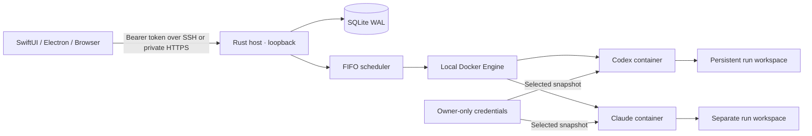

# Architecture



The host is intentionally a local process, not a privileged Docker-in-Docker control plane. It talks to the installed Docker CLI, preserving Docker contexts (Desktop, Colima, or local Engine). Use a **local Docker daemon**: bind-mount paths are resolved on the daemon's machine, so a remote Docker context is not supported. Each desktop client connects to one host at a time; multiple independent hosts need separate connections.

## State and scheduling

`queued → starting → running → succeeded / failed`

Cancellation persists `cancelling` for admitted runs, then the scheduler force-removes the container and records `cancelled`. A queued run can transition directly to `cancelled`. Every resource-bearing state reserves capacity. Admission is FIFO, with intentional head-of-line blocking to avoid starving larger runs. Budgets are user-configured and live-editable, not CPU-load prediction or automatic ballooning. An admission-policy mutex is always acquired before the job-store mutex, so settings changes cannot race admission. Updates validate Docker capacity and existing reservations, write an owner-only settings file atomically, and increment an optimistic revision. CLI limits bootstrap a new host; persisted settings take precedence thereafter.

A deterministic container name includes the run UUID. After a process crash, `starting`/`running` rows are reconciled against Docker. An already running container is adopted, an exited container yields its exit status, and an unstarted or missing container is marked failed rather than silently reexecuted. The database uses SQLite WAL and full synchronization. Version 1 stores a JSON job document per row; schema version is recorded with `user_version=1`. Future migrations must preserve old job decoding and be transactional.

A filesystem advisory lock prevents duplicate `serve` processes sharing state. API handlers lock SQLite briefly; Docker awaits happen outside the lock. One scheduler owns admission. A cancellation arriving during launch is preserved until the next reconciliation.

## Resource and trust model

- Docker enforces each run's CPU quota, memory/swap ceiling, and PID ceiling.
- A read-only root filesystem plus temporary home and `/tmp` avoids persistent provider installation state.
- Workspace and input mounts live under the private host data directory. Containers use the host owner's UID/GID so Linux export/cleanup works without root.
- CPU/memory totals are reserved against configured limits. Disk admission checks available space before launching work. Workspaces have no hard disk quota.
- Log rotation limits retained Docker logs to two 5 MB files per container. API output is the latest 500 lines, with stdout/stderr grouped by Docker output stream.
- Jobs use Docker's default outbound networking. No port publication, host networking, privileged mode, device mounts, or Docker socket.
- HTTPS termination and NAT traversal belong to SSH/Tailscale; the application refuses non-loopback binding.

The owner can grant arbitrary coding execution inside these containers. This is not a public hosted service or a security boundary between mutually hostile users. Provider/Git tokens are visible to that run's code. Protect host storage with OS full-disk encryption; use restricted repositories, restricted credentials, and a dedicated VM for untrusted tasks.

## Storage lifecycle

```text
~/.local/share/cloud-agents/
  token                  # random 256-bit bearer token, owner-only
  settings.json          # live budgets, pause state, optimistic revision
  host.lock              # exclusive scheduler lock
  state.db{,-wal,-shm}    # prompts, repository URLs, resource requests, status
  credentials/           # owner-only provider/Git sources
  jobs/<uuid>/
    input/prompt         # read-only inside container
    secrets/             # selected credential snapshots, removed on completion
    workspace/repo/      # retained working tree and .git
```

Completed containers remain for log retrieval. Delete removes the named container, workspace, and record. Timeout/cancellation removes the container immediately, so its Docker logs are unavailable afterward. Workspace export preserves symlinks in the archive rather than following them; inspect exported code before running it on your client.

The service stopping is not a request to kill all work: containers continue, but timeout enforcement pauses until the scheduler returns. A Docker daemon failure also delays cancellation/timeouts. No promise is made that provider requests survive a machine sleep or network interruption.

## Reproducibility

Cargo and npm lockfiles are committed. Provider CLI versions and the multi-architecture Node base digest are pinned. Debian security packages are resolved when building, so byte-identical image builds are not promised. Record the Docker image ID for a test/deployment; host state transitions are deterministic for observed events, but model results and external networks are not.

## Persistent client transport

Desktop clients supervise OpenSSH with loopback-only local forwarding, BatchMode, strict known-host verification, keepalives, and bounded retry backoff. SSH arguments are passed as an array without a shell. One client profile owns one tunnel. Reconfiguration and forgetting stop the old child; generation guards prevent stale retries reviving it. Clients retry observational reads, never task submissions. Saved profiles survive an offline restore and keep trying until the host returns. Browser clients reconnect their existing endpoint but cannot create SSH processes.

Host-token storage remains Keychain (native) / safeStorage with plaintext fallback refused (Electron). SSH private keys stay in the user's SSH setup. Electron keeps a tray/menu-bar process after window close; explicit Quit stops the tunnel. Native application state owns its tunnel across window lifetimes and stops it on application termination.
